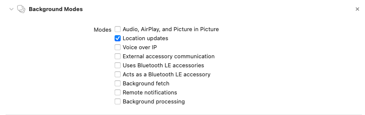
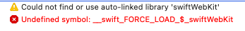
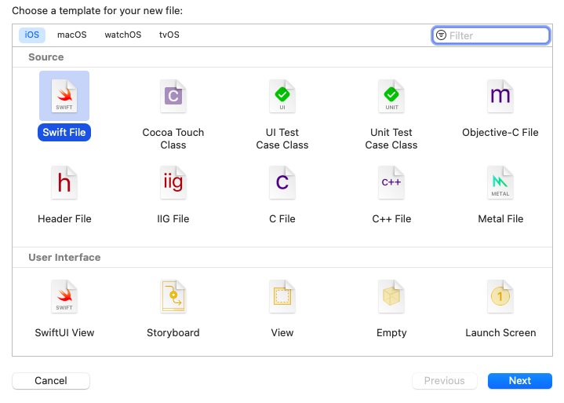
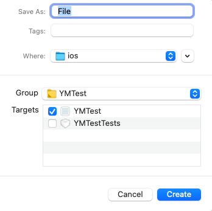

# What is react-native-yometu-geolocation

react-native-yometu-geolocation is a library that used to build applications such as fitness, cycling, and other sports that require location updates and timers.

> NOTE: Currently only available for iOS

##

## Installation

```sh
npm install react-native-yometu-geolocation

// or

yarn add react-native-yometu-geolocation
```

<details>
<summary><strong>iOS Installation Instructions</strong></summary>

### 1. Install with Cocoapods
You can also link the library using Cocoapods by adding this line to your `Podfile`:

```ruby
pod 'react-native-yometu-geolocation', :path => '../node_modules/react-native-yometu-geolocation/react-native-yometu-geolocation.podspec'
```
### 2. Info.plist usage descriptions
Finally, you then need to make sure you have the correct usage discriptions inside your `Info.plist` file. The message will show in the Alert box when your app requests permissions and lets the user know why you are asking for that permissions. They are also part of the App Store review process.

If you are only requesting "when in use" (foreground) location access you just need to make sure you have the `NSLocationWhenInUseUsageDescription` item in your Plist.

If you are requesting "always" (background) permission you will *also* need to add `NSLocationAlwaysAndWhenInUseUsageDescription` and `NSLocationAlwaysUsageDescription` into your PList file.

The easiest way to add these is to find your `Info.plist` in Xcode, right click on it, and then choose "edit as source code". You can then enter the items you need into the file:

```xml
<key>NSLocationWhenInUseUsageDescription</key>
<string>This is the plist item for NSLocationWhenInUseUsageDescription</string>
<key>NSLocationAlwaysAndWhenInUseUsageDescription</key>
<string>This is the plist item for NSLocationAlwaysAndWhenInUseUsageDescription</string>
<key>NSLocationAlwaysUsageDescription</key>
<string>This is the plist item for NSLocationAlwaysUsageDescription</string>
```

### 3. Background mode setup (optional)
For background location to work, a few things need to be configured:

1. In the Xcode project, go to Capabilities, switch on "Background Modes" and check "Location updates".


2. Set `NSLocationAlwaysAndWhenInUseUsageDescription` and `NSLocationAlwaysUsageDescription` in your `Info.plist` file.

</details>

## Usage

```js
import YometuGeolocation from "react-native-yometu-geolocation";
```

### Get geolocation authorization
This method must be initialized at the beginning (before accessing the location)
```js
YometuGeolocation.requestAuthorization();
```

### Get Realtime Position
In this method you have 2 successful callbacks where one is for realtime location and the other is for getting the timer
```js
// ...

const locationAuthorization = await YometuGeolocation.getPermissionStatus();

if (locationAuthorization.status) {
  watchId = YometuGeolocation.watchLocation(
    {
      accuracy: 'highAccuracy',
      allowBackground: true,
      distanceFilter: 1,
      withTimer: true,
    },
    (loc) => {
      console.log('Watch Current Location ===>', loc);
    },
    (getTimer) => {
      console.log('Watch Timer ====>', getTimer);
    },
    (err: any) => {
      console.log('err watch location ===>', err);
    }
  );
} else {
  // Triger if authorization denied
  console.log(locationAuthorization.message);
}
```
### Stop Realtime Position
```js
// ...

YometuGeolocation.stopWatchLocation(watchId);
```

### Paused Realtime Position
```js
// ...

YometuGeolocation.pauseWatchLocation();
```

### Resume Paused Realtime Position
```js
// ...

YometuGeolocation.resumeWatchLocation();
```
### Get Current Position

This method is used to get the location only occasionally when getting a certain action.

```js
// ...

const locationAuthorization = await YometuGeolocation.getPermissionStatus();

if (locationAuthorization.status) {
  YometuGeolocation.getLocation(
    {
      accuracy: 'highAccuracy',
      cacheAge: 10000,
      distanceFilter: 1,
      timeout: 15000,
    },
    (loc) => {
      console.log('Current Location ===>', loc);
    },
    (err: any) => {
      console.log('err single location ===>', err);
    }
  );
} else {
  console.log(locationAuthorization);
}
```

### Accuracy Options
| Accuracy Value           | Description                                                                                   |
|-------------------|-----------------------------------------------------------------------------------------------|
| bestForNavigation | The highest possible accuracy that uses additional sensor data to facilitate navigation apps. |
| nearestTenMeters  | Accurate to within ten meters of the desired target.                                          |
| hundredMeters     | Accurate to within one hundred meters.                                                        |
| kilometer         | Accurate to the nearest kilometer.                                                            |
| threeKilometers   | Accurate to the nearest three kilometers.                                                     |
| reduced           | The level of accuracy used when an app isn’t authorized for full accuracy location data.      |
| highAccuracy      | The best level of accuracy available.                                                         |

## Troubleshooting
<details>
<summary><strong>Error: <span style="color:red;">Undefined symbol: __swift_FORCE_LOAD_$_swiftWebkit</span></strong></summary>
if you have problems when building the project as below:



Create empty swift file in your project with XCode


Click next button, then save your empty file


XCode will ask you "Create Bridging Header".


You can choose "Create Bridging Header", after that rebuild your code, and everything works normally.
</details>

## Contributing

See the [contributing guide](CONTRIBUTING.md) to learn how to contribute to the repository and the development workflow.

## License

MIT
